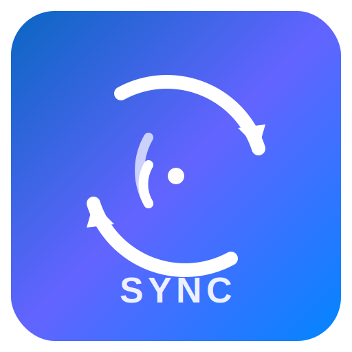

<p align="center">
  
</p>


# linkedin-blog-sync

A command-line tool that cross-posts blog entries from an Atom feed (or a local markdown file) to LinkedIn, Bluesky, and Mastodon.

It parses your feed, formats the content appropriately for each platform's constraints and conventions, optionally generates a short summary via an LLM, uploads featured images where supported, and tracks what has already been posted so you don't end up with duplicates.

## What it does

Given an Atom feed URL (configured via `BLOG_FEED_URL`) or a local `.md` file with YAML front matter, the tool will:

- Parse the post content and metadata (title, URL, tags, featured image, DOI if present)
- Format the text for each platform, respecting character limits (LinkedIn ~3000, Mastodon 500, Bluesky 300)
- Upload a featured image to LinkedIn and Bluesky if one exists
- Optionally call Claude or GPT to produce a short summary instead of posting full content
- Record the sync in a local JSON state file to prevent re-posting

It handles the differences between platforms so you don't have to think about them. LinkedIn gets the full formatted text with hashtags. Bluesky gets a short summary with a link card embed. Mastodon gets a concise post with a link.

## Commands

**`linkedin-sync`** (no subcommand) — syncs all of today's unsynced posts from the configured Atom feed.

**`linkedin-sync post <url>`** — syncs a single post by its feed URL.

**`linkedin-sync file <path>`** — syncs from a local markdown file instead of the feed. Useful when you want to post before the feed has updated, or when working with drafts.

**`linkedin-sync single "<message>"`** — posts an ad-hoc message to all social networks. This doesn't use a feed or markdown file — it posts exactly what you type. If the message contains a URL, a link card embed is created on LinkedIn and Bluesky (Mastodon auto-embeds links). Long messages are automatically threaded on Bluesky (>300 chars) and Mastodon (>500 chars), with thread indicators (🧵1/3, etc.).

You can include a local image path in the message and it will be uploaded as an image attachment on all platforms:

```bash
linkedin-sync single "Just published my new paper ~/screenshots/figure1.png"
```

The image path is automatically detected and stripped from the posted text — your followers will see `"Just published my new paper"` with the image attached, not the file path. Supported path formats:

- Absolute paths: `/home/user/photos/image.png`
- Home-relative: `~/photos/image.jpg`
- Relative: `./image.gif` or `../assets/photo.webp`

Supported image formats: `.png`, `.jpg`, `.jpeg`, `.gif`, `.webp`.

For threaded messages, the image is placed on the correct thread post based on where it appeared in the original text. If you put the image path near the end of a long message, it will be attached to the later thread post, not the first one.

You can combine an image with a URL in the same message. On LinkedIn, the image takes precedence over the link card embed.

**`linkedin-sync image-check <path>`** — scans a local markdown file for image references (markdown `` syntax, HTML `` tags, and front matter `image:` fields), then resizes any that exceed 1200×630 pixels. The resize preserves the original aspect ratio — it scales down to fit within the bounding box without cropping or stretching. This is useful for getting images into shape before posting.

**`linkedin-sync list`** — shows all previously synced posts and their platform URLs.

All commands accept `--dry-run` to preview without posting, `--force` to re-sync something already tracked, `--json-logs` for machine-readable output, and `-v` for debug logging. The `--summary` / `--no-summary` flag controls whether an LLM summary is generated.

## Setup

See [SETUP.md](SETUP.md) for full instructions on configuring LinkedIn OAuth credentials, Bluesky app passwords, Mastodon API tokens, and running the tool locally or via Docker.

The short version:

```bash
uv sync
cp .env.example .env
# fill in credentials
uv run linkedin-sync --dry-run
```

## Configuration

The tool is configured via environment variables in a `.env` file. The key blog-specific settings are:

| Variable | Description | Default |
|----------|-------------|---------|
| `BLOG_FEED_URL` | Atom feed URL for your blog | `https://eve.gd/feed/feed.atom` |
| `BLOG_SITE_URL` | Base URL of your blog (used for resolving relative image paths and deriving URLs from Jekyll-style filenames) | `https://eve.gd` |
| `BLOG_AUTHOR_CONTEXT` | Optional context about the author injected into LLM prompts for more personalised summaries (e.g. `"a professor who writes about open access"`) | _(empty)_ |

Platform credentials (`LINKEDIN_*`, `BLUESKY_*`, `MASTODON_*`) and LLM settings (`LLM_PROVIDER`, `LLM_MODEL`) are documented in `.env.example`.

## Markdown file format

When using `linkedin-sync file <path>`, the tool expects a markdown file with YAML front matter delimited by `---`:

```yaml
---
title: "My Blog Post"          # required
url: "https://example.com/..."  # required (or use a Jekyll-style filename)
date: 2026-03-21                # optional, defaults to now
tags:                           # optional, string or list
  - python
  - testing
image: featured.jpg             # optional, string or dict with feature/url key
doi: "10.1234/example"          # optional
author: "Jane Smith"            # optional
---

Your markdown content here...
```

If `url` (or `permalink`) is omitted, the tool infers it from a Jekyll-style filename (`YYYY-MM-DD-slug.md`) combined with `BLOG_SITE_URL`. Relative image filenames (e.g. `image: photo.jpg`) are resolved to `BLOG_SITE_URL/images/photo.jpg`.

## Tests

The test suite covers feed parsing, markdown file parsing, content formatting, image extraction and resizing, all three platform clients, the CLI interface, sync state tracking, LLM summarisation, and logging configuration. Tests use `pytest` with `unittest.mock` for external API calls — nothing hits the network.

```bash
uv run pytest           # run the suite
uv run pytest -v        # verbose
uv run pytest --cov     # with coverage
```

Current state: **292 tests passing, 93% line coverage**. Coverage by module:

| Module | Coverage |
|--------|----------|
| `src/linkedin_sync/bluesky_client.py` | 100% |
| `src/linkedin_sync/sync_tracker.py` | 100% |
| `src/linkedin_sync/logging_config.py` | 100% |
| `src/linkedin_sync/mastodon_client.py` | 100% |
| `src/linkedin_sync/image_checker.py` | 96% |
| `src/linkedin_sync/formatter.py` | 96% |
| `src/linkedin_sync/summarizer.py` | 96% |
| `src/linkedin_sync/feed_parser.py` | 91% |
| `src/linkedin_sync/sync.py` | 90% |
| `src/linkedin_sync/linkedin_client.py` | 90% |

## Dependencies

The main runtime dependencies are [Click](https://click.palletsprojects.com/) for the CLI, [feedparser](https://feedparser.readthedocs.io/) for Atom parsing, [Pillow](https://pillow.readthedocs.io/) for image handling, [atproto](https://atproto.blue/) for Bluesky, [Mastodon.py](https://mastodonpy.readthedocs.io/) for Mastodon, [structlog](https://www.structlog.org/) with [Rich](https://rich.readthedocs.io/) for logging, and the [Anthropic](https://docs.anthropic.com/en/docs/initial-setup) and [OpenAI](https://platform.openai.com/docs/) SDKs for optional LLM summarisation.

## License

GPL-2.0.
